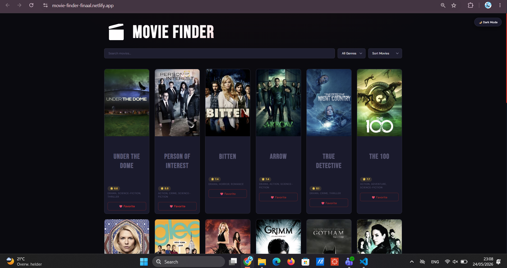
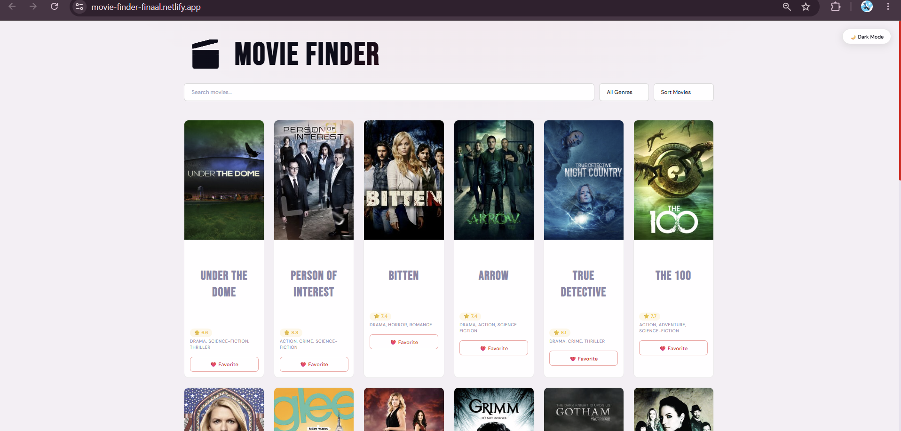
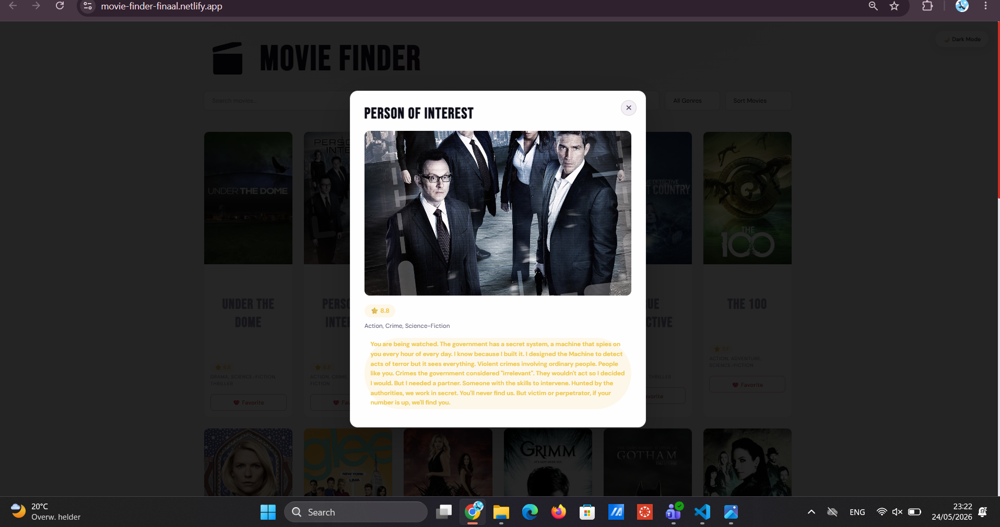

# 🎬 Movie Finder

Een interactieve single-page applicatie gemaakt voor het vak Web Advanced.  
Met deze app kan je films en series zoeken, filteren, sorteren en opslaan als favoriet.

---

# Waarom dit onderwerp?

Ik kijk vaak films en series en vond het daarom leuker om een project te maken rond entertainment in plaats van een willekeurige dataset.

De TVMaze API was handig omdat ze gratis is, geen API-key nodig heeft en veel data teruggeeft in één request. Daardoor kon ik snel werken met echte data en tegelijk oefenen op filtering, localStorage, modals en dynamische rendering.

Tijdens het maken van dit project heb ik veel geëxperimenteerd met layouts, animaties en responsive design. In het begin zag de applicatie er vrij basic uit, maar stap voor stap heb ik de styling verbeterd met een modernere interface, dark mode en hover effecten.

---

# Wat doet de app?

- Films en series ophalen via de TVMaze API
- Kaartweergave met posters, genres en ratings
- Zoeken op naam
- Filteren op genre
- Sorteren op alfabet of rating
- Favorieten toevoegen en verwijderen
- Favorieten bewaren via localStorage
- Dark/light mode met opgeslagen voorkeur
- Detailmodal met extra info over een film of serie
- Scroll animaties via IntersectionObserver
- Responsive design voor mobiel en desktop

---

# Gebruikte API

TVMaze API — https://api.tvmaze.com/shows

Gratis API zonder API-key.  
Geeft film- en seriegegevens terug zoals posters, ratings, genres en beschrijvingen.

---

# Installatie

```bash
npm install
npm run dev
```

Open daarna:

```bash
http://localhost:5173
```

Voor een production build:

```bash
npm run build
```

De build bestanden komen terecht in de `dist/` map.

---

# Mappenstructuur

```bash
movie-finder/
├── index.html
├── package.json
├── vite.config.js
├── .gitignore
├── dist/
└── src/
    ├── main.js
    └── style.css
```

---

# Technische vereisten

## DOM manipulatie

- Elementen selecteren via `querySelector`
- Dynamisch HTML renderen met `innerHTML`
- Klassen toevoegen/verwijderen via `classList`
- Dynamische kaarten genereren uit API-data

## Modern JavaScript

- `const` en `let`
- Template literals
- Arrow functions
- Array methods:
  - `map()`
  - `filter()`
  - `sort()`
  - `includes()`
- Ternary operators
- Callback functions
- Async/Await
- Promises

## API & data

- `fetch()` gebruikt om data op te halen
- JSON verwerken via `response.json()`
- TVMaze API integratie

## LocalStorage

Gebruikt voor:

- Favorieten bewaren
- Theme voorkeur bewaren

## Observer API

IntersectionObserver gebruikt voor scroll animaties op movie cards.

## Styling & layout

- CSS Grid voor de movie layout
- Flexbox voor controls en responsive onderdelen
- Responsive design met media queries
- Dark/light theme
- Hover animaties en modals

## Tooling

- Vite gebruikt als development environment
- Project opgebouwd met aparte CSS en JavaScript bestanden

---

# Gebruikersvoorkeuren (LocalStorage)

| Sleutel | Beschrijving |
|---|---|
| favorites | Favoriete films |
| theme | Dark of light mode |

---

# Reflectie

Met dit project heb ik beter geleerd hoe APIs werken met fetch en async/await, hoe localStorage gebruikt wordt en hoe dynamische rendering werkt met JavaScript.

Daarnaast heb ik veel geoefend op responsive design, CSS Grid, Flexbox en het combineren van functionaliteit met een moderne interface.

---
---

# Bronnen

- TVMaze API — https://api.tvmaze.com/shows
- Google Fonts — https://fonts.google.com/
- Vite Documentation — https://vitejs.dev/
- MDN Web Docs — https://developer.mozilla.org/

Tijdens het maken van dit project heb ik ook gebruik gemaakt van online documentatie, tutorials en AI-tools voor debugging, styling inspiratie en uitleg van bepaalde JavaScript concepten.
# Auteur

Gemaakt door Zaid voor het vak Advanced Web Development.

## Screenshots




